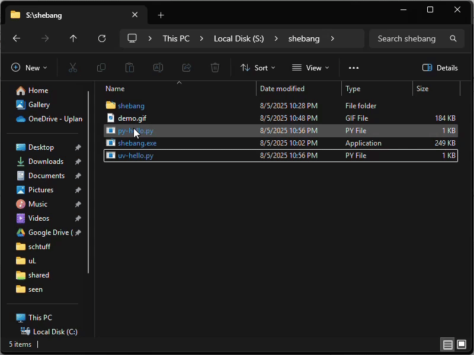

# Shebang for Windows

Run Linux-style scripts on Windows with their native shebang interpreters!



## What is Shebang?

The fantastic [UV project](https://github.com/astral-sh/uv) revolutionizes Python development by letting you declare dependencies right inside your script comments. No more virtual environments, no more conda, no more pip install - your scripts just work! UV reads the dependencies from comments and automatically manages everything for you.

But here's the catch: Windows file associations are limited. You can't associate `.py` files with something like `uv run --script`. Windows only lets you associate extensions with executables, not with command-line arguments.

**Shebang solves this problem and many more.** It's a tiny executable that reads the shebang line (the `#!` at the top of your scripts) and launches your files with whatever command-line you specify. Now your text files can run themselves with any interpreter or tool - UV, Python, Bash, Node.js, or anything else.

This means you can:
- Have some Python scripts run with `uv run` for automatic dependency management
- Have other Python scripts run with plain `python.exe` 
- Run shell scripts with `bash.exe` on Windows
- Use the exact same scripts on Linux and Windows with zero modifications

The file itself decides how it should run. True cross-platform scripting at last!

## Features

- 🚀 **Cross-platform script execution** - Use the same scripts on Linux and Windows without changes
- 🎯 **Shebang interpreter** - Reads and respects the shebang line (`#!`) at the top of your scripts
- 🔧 **Flexible execution** - Supports various interpreters like Python, UV, Bash, Node.js, etc.
- 📦 **Zero configuration** - Just associate file extensions with shebang.exe
- 🪟 **Windows-optimized** - Handles `/usr/bin/env` shebangs gracefully on Windows

## How It Works

1. You associate script file extensions (`.py`, `.sh`, etc.) with `shebang.exe` in Windows
2. When you double-click or run a script, Windows calls `shebang.exe` with the script path
3. Shebang reads the first line of your script (the shebang line)
4. It parses the interpreter command and executes your script with the correct program

## Examples

### Python Script with UV (Automatic Dependency Management)
```python
#!/usr/bin/env -S uv run --script --quiet
# /// script
# requires-python = ">=3.8"
# dependencies = [
#     "click",
#     "requests",
#     "pandas",
# ]
# ///
import click
import requests
import pandas as pd

# Dependencies are automatically installed by UV!
# No virtual environment needed!
print('All dependencies just work!')
```

### Regular Python Script
```python
#!/usr/bin/env python
print('Hello, World!')
```

### Bash Script
```bash
#!/bin/bash
echo "Running on Windows with bash.exe!"
```

## Installation

1. Download or build `shebang.exe`
2. Place it in a directory in your PATH (or remember its location)
3. Associate file extensions with shebang.exe:
   - Right-click on a `.py` file → "Open with" → "Choose another app"
   - Browse to `shebang.exe` and select it
   - Check "Always use this app to open .py files"
   - Repeat for other extensions (`.sh`, `.rb`, etc.)

## Building from Source

Requirements:
- Rust toolchain (install from [rustup.rs](https://rustup.rs/))

```bash
cd shebang
cargo build --release
```

The executable will be in `target/release/shebang.exe`

## Supported Shebang Formats

- `#!/usr/bin/env python` - Standard env shebang
- `#!/usr/bin/env -S uv run --script` - Env with options
- `#!/usr/bin/python` - Direct interpreter path
- `#!/bin/bash` - Shell scripts
- Any other valid shebang line!

## How Shebang Handles Arguments

The program correctly handles:
- Shebang arguments (e.g., `#!/usr/bin/python -u`)
- Script arguments passed when running the script
- Special `--` separator for argument ordering control

## License

This project is open source. Contributions are welcome!

## Troubleshooting

### "No shebang line found" Error
Make sure your script starts with `#!` on the very first line.

### "Failed to execute command" Error
Ensure the interpreter specified in your shebang line is installed and in your PATH.

### Scripts open in text editor instead
You need to associate the file extension with `shebang.exe` rather than your text editor.

## Contributing

Contributions are welcome! Please feel free to submit issues and pull requests.